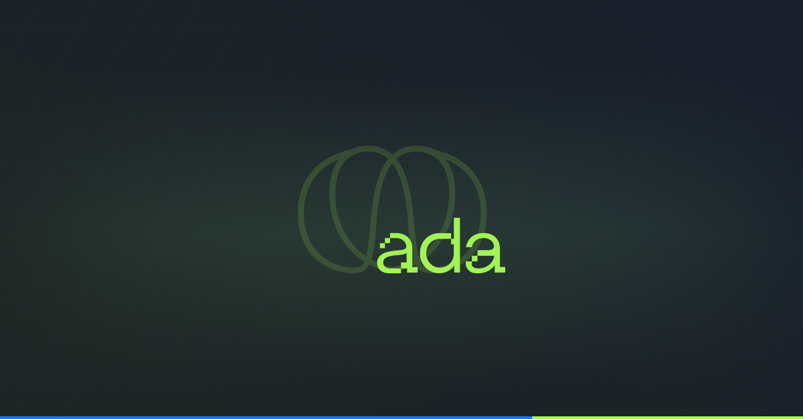

# Curso-ADA
Apenas para uso de aprendizado

<h1> RESUMO </h1>
Sou um iniciante dentro da área de dados. Fui aprovado para a turma 1102 do programa <a href="https://ada.tech/sou-aluno/programas/ifood-vem-ser-tech">Vem Ser Tech </a>, do ADA, na trilha de Dados.
Esse repositório é, portanto, minha forma de armazenar e demonstrar meus conhecidmentos adquiridos durante o curso. :D

<h1> <a href="https://github.com/sanshee2/Curso-ADA/blob/main/Projeto_da_Pizzaria.ipynb"> PROJETO 1- LÓGICA DE PROGRAMAÇÃO </a></h1>
Nos primeiros momentos do curso fomos instigados a organizar instruções em ordem, na forma de algoritmos.
